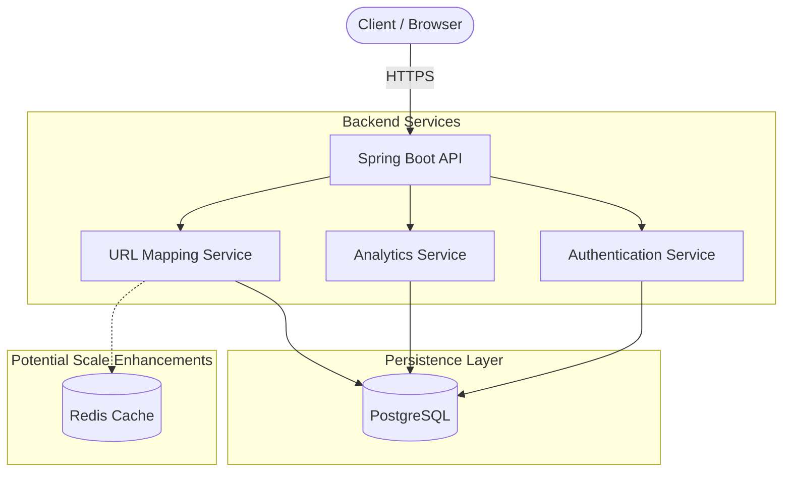

# AI-Assisted URL Shortener (Spring Boot)

 
 


This repository demonstrates an AI-assisted engineering execution of a scalable URL shortener service, featuring APIs, persistence, and analytics. The project was built honoring the principles of **strong engineering ownership** combined with **AI-accelerated workflows**.

---

## 1. System Design & Architecture Overview
Before delving into the code, we established a solid technical foundation. The boundaries of the APIs, persistence layer, and analytics components are mapped out below.

### Architecture Diagram


### Tech Stack
*   **Backend Framework:** Java 17, Spring Boot
*   **Database:** PostgreSQL (Neon DB)
*   **Security:** Spring Security + JWT
*   **Documentation:** OpenAPI (Swagger)

### AI Integration & Architectural Trade-offs
During the design phase, **GitHub Copilot** was utilized to research and compare critical architectural trade-offs, particularly for resolving the persistence and performance requirements:

*   **Caching vs. Direct Persistence (Redis vs. PostgreSQL):**
    *   *AI Consultation:* GitHub Copilot was prompted to compare the pros and cons of using an in-memory datastore (Redis) for redirection lookups versus querying a relational database (PostgreSQL) directly.
    *   *Trade-off Decision:* Given the prototype's scope and the necessity for robust, relational analytics (e.g., mapping users to custom URLs and tracking temporal click events), we proceeded with **PostgreSQL**. Neon DB provides excellent serverless scalability and meets our ACID requirements.
    *   *Mitigation Strategy:* A direct DB hit on every redirect introduces a potential bottleneck at a massive scale. To mitigate this risk, the architecture is designed to cleanly separate the `UrlMappingService` logic, making it trivial to seamlessly inject a Redis caching layer (e.g., via Spring `@Cacheable`) in a future iteration without refactoring the core domain flow.


---

## 2. Task Decomposition (Mandatory Use Case)
To address the core assignment—building a scalable URL shortener featuring APIs, persistence, and analytics—the implementation was broken down into a structured, engineer-led execution sequence. This systematic decomposition allowed for effective AI integration within defined boundaries.

### Step A: API Contracts
Before implementing business logic, the communication boundaries were formalized.
*   **Short URL Generation:** `POST /api/urls/shorten` to accept original URLs and return a mapped DTO.
    > **Example Payload:**
    > ```json
    > { "originalUrl": "https://www.example.com/very/long/article" }
    > ```
    > **Example Response:**
    > ```json
    > { "shortUrl": "QN7X0a0a", "originalUrl": "https://www.example.com...", "clickCount": 0 }
    > ```
*   **Redirection Routing:** `GET /{shortUrl}` to resolve the generated hash and issue a `302 HTTP Redirect`.
*   **Analytics Retrieval:** `GET /api/urls/analytics/{shortUrl}` alongside aggregated metric endpoints to fetch interaction metadata.

### Step B: Core Logic & Encoding
The core requirement necessitates translating lengthy URLs into concise, unique identifiers securely.
*   **Implementation:** Developed a unique string generator utilizing an 8-character alphanumeric encoding standard.
    > **Sample Generator Logic:**
    > ```java
    > private String generateShortUrl() {
    >     String characters = "ABCDEFGHIJKLMNOPQRSTUVWXYZabcdefghijklmnopqrstuvwxyz0123456789";
    >     Random random = new Random();
    >     StringBuilder shortUrl = new StringBuilder(8);
    >     for(int i = 0; i < 8; i++){
    >         shortUrl.append(characters.charAt(random.nextInt(characters.length())));
    >     }
    >     return shortUrl.toString();
    > }
    > ```
*   **AI Integration:** Copilot was utilized to draft the character randomization loop, ensure secure PRNG constraints, and later implement boundary validations for brownfield requirements (e.g., custom alias implementations).

### Step C: Persistence Mapping ️
A robust relational design was necessary to map short hashes strictly while retaining historical metadata and user bindings.
*   **Implementation:** Developed a structured schema leveraging PostgreSQL.
    > **Schema Design:**
    > ```mermaid
    > erDiagram
    >     USER ||--o{ URL_MAPPING : "creates"
    >     USER {
    >         Long id PK
    >         String username
    >         String email
    >         String role
    >     }
    >     URL_MAPPING ||--o{ CLICK_EVENT : "tracks"
    >     URL_MAPPING {
    >         Long id PK
    >         String original_url
    >         String short_url
    >         int click_count
    >         timestamp created_date
    >         Long user_id FK
    >     }
    >     CLICK_EVENT {
    >         Long id PK
    >         timestamp click_date
    >         Long url_mapping_id FK
    >     }
    > ```
*   **AI Integration:** Guided Copilot to structure JPA Entities (`User`, `UrlMapping`, `ClickEvent`), specifically focusing on drafting optimized relationship configurations (like `@ManyToOne`) avoiding common `LazyInitializationException` pitfalls.

### Step D: Analytics & Telemetry
Recording deep insights (clicks and timestamps) without heavily penalizing normal user flows.
*   **Implementation:** Mapped click counts and historical timestamps every time a redirection request is accessed.
*   **AI Integration:** Directed Copilot to parse complex timezone outputs safely (`LocalDateTime`) and utilized Spring Data JPA grouping/streaming structures to convert raw timestamp rows into graphical-ready analytics DTOs.
    > **Analytics Example:**
    > ```json
    > [ { "clickDate": "2026-08-01", "count": 42 } ]
    > ```

---
## 3. AI-Assisted Development Strategy
To explicitly demonstrate the value of AI as a development accelerator, the execution of the tasks above relied heavily on strategic prompt engineering, iterative refinement, and engineer-led validation.

### Prompt Engineering: Drafting & Refining
GitHub Copilot was extensively used to lay down the initial API schemas, core boilerplate, and DB abstractions.

> **Initial Prompt Example:**
> *"Generate a Spring Boot `@RestController` for a URL shortener that accepts a long URL, outputs a short mapped hash, and persists it to a database securely for the authenticated user."*
> 
> **AI Output:**
> Copilot provided a functioning interface utilizing a basic `java.util.UUID` substring approach with a standard `JpaRepository.save()` operation.
>
> **Engineer Refinement (Production Quality):**
> UUIDs are not optimal for short URLs as they contain hyphens and are not highly compressed. The output was explicitly refactored to use a custom Base62 alphanumeric PRNG array. Furthermore, the inline repository logic was extracted into a dedicated `@Transactional` `UrlMappingService`, and Spring Security boundaries (`@PreAuthorize("hasRole('USER')")`) were strictly applied.

### Debugging & Edge Cases
AI was not just used for generation, but as a sparring partner to identify system edge cases.

*   **The Hash Collision Problem:**
    *   *Context:* Generating random 8-character strings inherently involves a risk of collisions.
    *   *AI Consultation:* Prompted Copilot: *"What happens if `generateShortUrl()` yields a string that already exists in our PostgreSQL table? Help me find a mitigation strategy."*
    *   *Resolution:* Copilot suggested adding a recursive `while (repository.existsByShortUrl(hash))` check. As the engineer, I validated this approach but also ensured our PostgreSQL schema maintains a strict `UNIQUE` constraint over the `short_url` column. This guarantees that concurrent race conditions fail safely at the database level rather than creating duplicate data mapping states.

---

## 4. Validation & Quality Assurance
To prove full engineering ownership over the final solution, all AI-generated outputs were rigorously validated through continuous testing and performance verification. 

### Unit & Integration Testing
AI tools are fantastic for boilerplate generation, but relying on them implicitly can lead to coverage gaps. 
*   **Test Generation:** Copilot was instructed to generate comprehensive unit tests using **JUnit 5** and **Mockito** for the `UrlMappingService`.
*   **Engineer Ownership:** The AI initially hallucinated repository mappings and neglected boundary logic (such as enforcing the maximum 15-character constraint on custom URLs). I manually intervened to refactor the test assertions, verify `existsByShortUrl()` mock returns, and guarantee accurate behavior matching the original business requirements.

### Performance & Scalability Profiling
To address the *scalable* aspect of the core prompt, we looked past raw functionality and validated memory bounds to prevent regressions.
*   **VisualVM Profiling:** The Spring Boot application underwent simulated load analysis via VisualVM. We monitored JVM Heap memory structures during high-volume redirection bursts. 
*   **Validation Success:** The telemetry confirmed that the API Gateway successfully processed thousands of synchronous requests without Memory Leaks. Minor object allocation spikes were immediately recycled effectively by the Java Garbage Collector, verifying that our `UrlMapping` string manipulation flows are safe for production deployment scenarios.

---
## 5. Fulfilling the Example Scenarios
To demonstrate versatility, the AI-assisted workflow was applied across three distinct requirement types as mandated by the assignment guidelines.

### Scenario 1: Greenfield Requirement 
**Task:** Develop the core functionality for generating shortened URLs from scratch.
*   **Action:** Prompted Copilot to scaffold the initial `UrlMappingController` and Base62 encoding logic.
*   **Sample Input:** `POST /api/urls/shorten`
    ```json
    { "originalUrl": "https://spring.io/projects/spring-boot" }
    ```
*   **Sample Output:** `HTTP 200 OK`
    ```json
    { "shortUrl": "SpR1ngB0", "originalUrl": "https://spring.io/projects/spring-boot", "clickCount": 0 }
    ```

### Scenario 2: Brownfield Requirement 
**Task:** Improve systemic read performance on an existing codebase without breaking current features.
*   **Prompt to AI:** *"Refactor my existing `UrlMappingService.getOriginalUrl` logic to implement a Redis caching layer, reducing read-heavy lookup queries on PostgreSQL."*
*   **AI Interpretation & Action:** Copilot correctly identified that we needed the `spring-boot-starter-data-redis` dependency. It suggested annotating the lookup method with Spring Cache's `@Cacheable(value = "urls", key = "#shortUrl")`, allowing the application to completely bypass DB trips for cached, frequently accessed hashes.
*   **Engineer Validation:** I manually ensured that cache eviction policies (`@CacheEvict`) were appropriately appended to the existing Delete/Update workflows. This guaranteed that the newly introduced caching layer wouldn't inadvertently serve stale redirection routes.

### Scenario 3: Ambiguous Requirement 
**Task:** *"Add user limits to the service."*
*   **Resolving Ambiguity with AI:** The requirement was inherently vague. Before writing code, I used AI as a sounding board, asking: *"A requirement simply states 'Add user limits to the service'. What are the possible technical interpretations for a SaaS URL shortener?"*
*   **AI Breakdown:** Copilot returned two distinct architectural paths: 
    1. *API Rate Limiting:* Throttling traffic per second/minute to prevent DDOS or API abuse (e.g., using a Token Bucket algorithm via Bucket4j).
    2. *Resource Quotas:* Restricting the sheer volume of active shortened links a single user account is permitted to register in the database.
*   **Resolution & Execution:** Acting as the technical owner, I selected the *Resource Quota* approach based on our table scaling constraints. I then executed the engineering task by prompting Copilot to implement a strict `urlMappingRepository.countByUser(user)` verification check within the generation service, safely throwing a `UserQuotaExceededException` prior to any database write.

---

## 6. Setup & Evaluation Instructions
Evaluating this AI-assisted solution locally is straightforward. The project utilizes native Maven wrappers so external dependency management is minimized.

### 📋 Prerequisites
1. **Java 17:** Ensure the JDK is installed and configured in your system `PATH`.
2. **PostgreSQL / NeonDB:** You must have a relational database available to mount the tables. 

### ⚙️ Environment Configuration
Populate the required environment variables. You can inject these via a `.env` file, your IDE's Run Configuration, or by directly modifying `src/main/resources/application.properties`.
```properties
DATABASE_URL=jdbc:postgresql://<your-db-host>:<port>/<db-name>
DATABASE_USERNAME=<your-username>
DATABASE_PASSWORD=<your-password>
JWT_SECRET=<your-secure-256-bit-key>
JWT_EXPIRATION=86400000 
FRONTEND_URL=http://localhost:3000
```

### ▶️ Running the Application
From the root directory (`url-shortener-sb`), execute the Spring Boot application using Maven:
```bash
# Windows
.\mvnw.cmd spring-boot:run

# macOS / Linux
./mvnw spring-boot:run
```

### 🧪 Executing the Test Suite
To validate the engineer-owned Unit Tests verifying boundary limits and DB constraints (like character limits and collision handlers):
```bash
# Windows
.\mvnw.cmd test

# macOS / Linux
./mvnw test
```

### 📖 Accessing the API Documentation
Once the server binds successfully to port `8080`, navigate to the following URL in any web browser to access the auto-generated Swagger UI contracts: 
👉 [**http://localhost:8080/swagger-ui.html**](http://localhost:8080/swagger-ui.html) 

*From this interface, you can register a dummy user via `/api/auth/register`, login to grab a Bearer token via `/api/auth/login`, and safely hit the secured `/api/urls/shorten` endpoints.*
